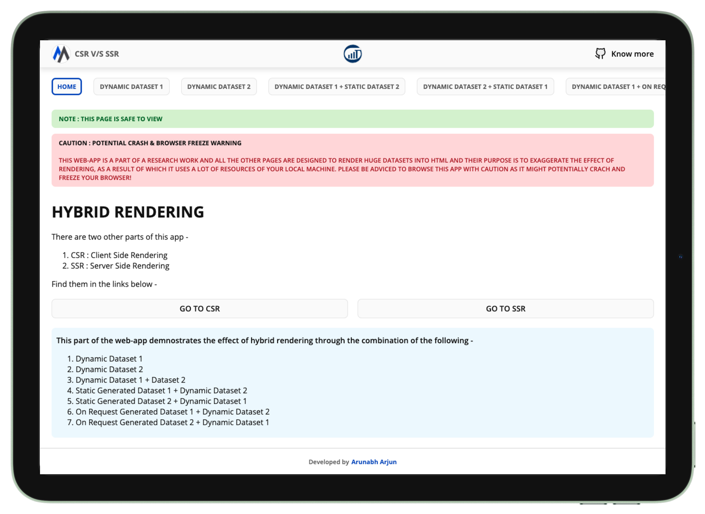

# CSR v/s SSR research work by Arunabh Arjun

## 🔗 APP LINKS
### [LINK 1 : CLIENT SIDE RENDERING](https://csr-of-csr-vs-ssr-arunabharjun.vercel.app)
### [LINK 2 : SERVER SIDE RENDERING](https://ssr-of-csr-vs-ssr-arunabharjun.vercel.app)
### [LINK 3 : HYBRID RENDERING](https://hybrid-of-csr-vs-ssr-arunabharjun.vercel.app)


## 🗂 Repository file structure
1. [backend [sub-repo for backend APIs]](https://github.com/arunabharjun/ssr-vs-csr/tree/main/backend) 
2. [client [sub-repo for all client apps]](https://github.com/arunabharjun/ssr-vs-csr/tree/main/client)
    * [CSR [codebase for CSR app]](https://github.com/arunabharjun/ssr-vs-csr/tree/main/client/CSR)
    * [SSR [codebase for CSR app]](https://github.com/arunabharjun/ssr-vs-csr/tree/main/client/SSR)
    * [Hybrid [codebase for Hybrid Rendered app]](https://github.com/arunabharjun/ssr-vs-csr/tree/main/client/Hybrid)

Each of them have their own README file for instructions on how to get started and run the app

## ▶️ Getting Started

1. Open terminal in your project directory

2. Clone the repo

```bash
git clone https://github.com/arunabharjun/ssr-vs-csr.git
```

3. The CSR and SSR apps can be run directly without having to setup the backend APIs
    * Follow [README file for CSR](https://github.com/arunabharjun/ssr-vs-csr/blob/main/client/CSR/README.md) to get started with the CSR project
    * Follow [README file for SSR](https://github.com/arunabharjun/ssr-vs-csr/blob/main/client/SSR/README.md) to get started with the SSR project
4. The hybrid APP will require backend APIs. So to get started with the hybrid app, first start the backend and then start the hybrid app
    * Follow [README file for BACKEND](https://github.com/arunabharjun/ssr-vs-csr/blob/main/backend/README.md) to get started with the BACKEND project
    * Follow [README file for HYBRID](https://github.com/arunabharjun/ssr-vs-csr/blob/main/client/Hybrid/README.md) to get started with the BACKEND project